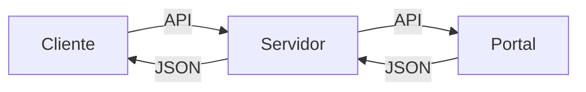

# RESTful API

Projeto da disciplina **Sistemas Distribuídos** do Instituto de Computação - Universidade Federal de Alagoas. Prof. André Lage.

## Descrição

implementar uma Aplicação A baseada na arquitetura RESTful e que utilize as seguintes operações HTTP:
- POST
- PUT
- GET
- DELETE
As funcionalidades da aplicação terão que usar dados do Portal da Transparência do Governo Federal, através da sua API de dados: 
[www.portaltransparencia.gov.br](http://www.portaltransparencia.gov.br/api-de-dados)

## Ferramentas Utilizadas

Servidor : PHP, Slim Framework, MySQL.
Cliente: PHP, HTML 5, Bootstrap 4, PHPlot.

## Instalação

Para executar o nosso servidor, você precisa ter instalado na sua máquina os serviços Apache, MySQL e PHP. Eles podem ser obtidos gratuitamente baixando programas como: [XAMPP](https://www.apachefriends.org/pt_br/download.html), [WampServer](http://www.wampserver.com/en/) ou similares.

### Vamos para o passo a passo:
1. Faça a importação do arquivo **PortalEstatistica.sql** no seu bando de dado, o arquivo pode ser encontado na pasta RESTful-API/server/banco.
2. Configure o usuário e senha do banco de dado no arquivo **conection.php**, o mesmo pode ser encontrado na pasta RESTful-API/server/class. Por padrão nosso programa vem configurado assim: 
~~~~
<?php
class Database
{
    private $host = "localhost";
    private $db_name = "PortalEstatistica";
    private $username = "root";
    private $password = "";
    public $conn;
~~~~
3. Abra seu navegador e acesse o no servidor. 
Exemplo : http://localhost/server/
aparecerá a mesagem : Bem-vindo ao Servidor

## Funcionalidades do Servidor
Na tabela abaixo listamos todas as funcionalidades do nosso servidor.
|Operação                |Comando                         |Descrição                         |
|----------------|-------------------------------|-----------------------------|
|GET|`'/server'`   |Apresenta uma tela de Bem-vindo     |
|GET|`/server/data`|Retorna todos os dados do banco            |
|GET|`/server/data/id`|Retorna uma consulta onde id é o numero de indentificação no banco de dados|
|GET|`'/server/ano/codIBGE'`   |Pega os dados do Portal Transparência e carrega no nosso bando de dado em seguida retorna com valores estatísticos     |
|POST|`'/server/data'`   |Essa opção preenche os dados manualmente no banco de dados     |
|PUT|`'/server/id'`   |Atualiza uma consulta onde id é o numero de indentificação no banco de dados|
|DELETE|`'/server/id'`   |Deleta uma consulta no banco de dados|

## Funcionalidade do Cliente

O Cliente possuí uma interface, aonde podemos utilizar todos os recursos do servidor com a opção de gerar gráficos dos dados.

> _“As tecnologias mais profundas e duradouras são aquelas que desaparecem. Elas dissipam-se nas coisas do dia a dia até tornarem-se indistingüíveis.”_  
Mark Weiser – 1952 a 1999 – Cientista Chefe do XEROX PARC
